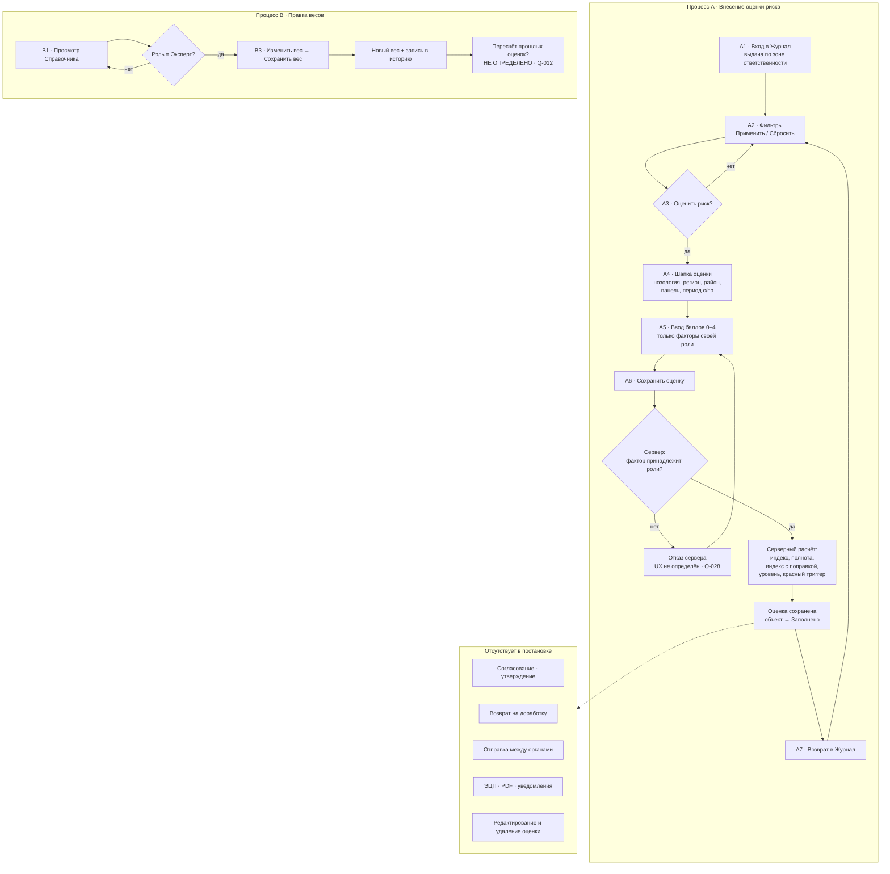
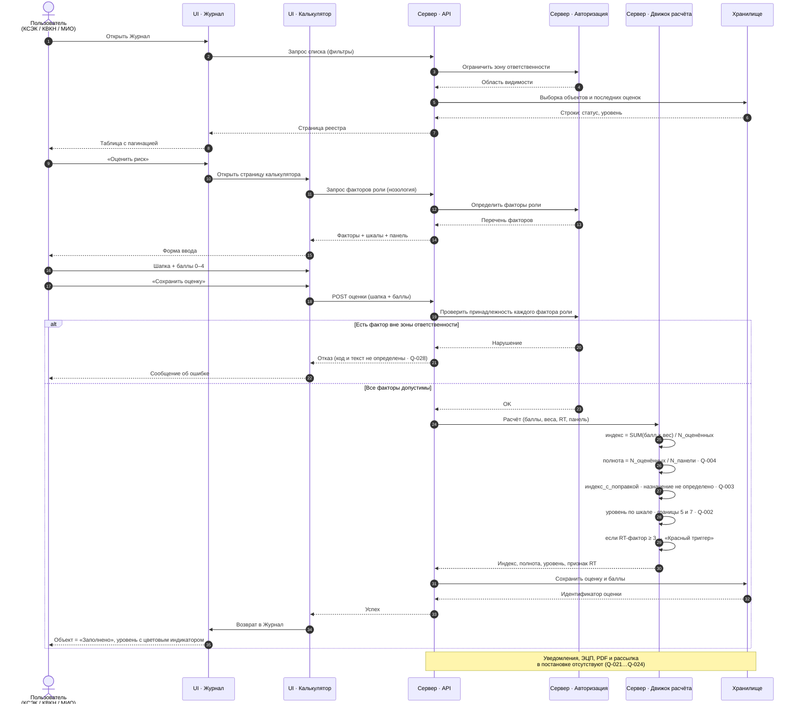

# Бизнес-процесс (нормализованный)

> **Подтверждено кодом.** Процесс из постановки описан ниже верно, существующая реализация
> ему не противоречит. Уточнения по фактическому состоянию:
>
> - шаги A1–A3 (журнал, фильтры, переход в калькулятор) **не реализованы** — журнала нет;
> - шаг A5 (ввод баллов) реализован **без ограничения по роли**: доступны все 46 факторов;
> - шаг A6 (сохранение и серверный расчёт) реализован, но проверка принадлежности фактора роли
>   отсутствует, а расчётные величины не сохраняются;
> - шаг B2 (правка веса) **не реализован**;
> - дополнительно есть операция, которой нет в постановке: `POST /assessments/preview` —
>   расчёт без сохранения. Она попадает в предметную область `Q-050` (черновик).
>
> Разбор — [as-is-gap-analysis.md](../02_TECHNICAL/as-is-gap-analysis.md).

Пометки — см. [overview.md](overview.md).

---

## 0. Важное предуведомление о границах процесса

Шаблон задания предполагает процесс вида «создание плана → согласование → проверка → чек-лист → заключение».

`[ПРОБЕЛ · критический]` **В настоящей постановке такого процесса нет.** В ней отсутствуют:
план, согласование, утверждение, проверка, чек-лист, заключение, подписание, отправка, возврат на доработку.

Реальный процесс постановки — **параллельный сбор балльных данных тремя органами и детерминированный
серверный расчёт**. Он нормализован ниже «как есть». Всё, что относится к маршрутизации документов,
вынесено в `open-questions.md` (`Q-013`, `Q-014`, `Q-021`–`Q-024`) и **не додумывалось**.

### Статусная модель, которую даёт постановка

`[ТРЕБОВАНИЕ · Прил. 1 п.5, п.6]` Постановка определяет ровно два независимых перечисления:

| Перечисление | Значения | Природа |
|---|---|---|
| **Статус объекта в журнале** | `Заполнено` / `Не заполнено` | Производное состояние: «есть ли хотя бы одна сохранённая оценка по объекту за период» |
| **Уровень риска** | `Низкий` / `Средний` / `Высокий` / `Очень высокий` / `Красный триггер` | Результат расчёта, **не статус жизненного цикла** |

`[ВЫВОД]` Собственного жизненного цикла (черновик → на согласовании → утверждено и т.п.)
у оценки риска в постановке **нет**. Сохранение — единственный переход.

---

## 1. Процесс A. Внесение оценки риска (основной)

### Шаг A1. Вход в журнал

| Атрибут | Значение |
|---|---|
| **Actor** | `ROLE_KSEK` / `ROLE_KVKN` / `ROLE_MIO` / `ROLE_EXPERT` |
| **Preconditions** | Пользователь аутентифицирован; ему назначена одна из четырёх ролей модуля |
| **Action** | Открывает раздел «Журнал». Система показывает реестровую таблицу с пагинацией и панель фильтров |
| **Validation** | Выборка ограничена зоной ответственности роли; для `ROLE_EXPERT` — без ограничений (§3.1). Территориальное ограничение не определено — `Q-011` |
| **Current status** | — (состояние объектов в выдаче: `Заполнено` / `Не заполнено`) |
| **Resulting status** | не меняется |
| **Next actor** | тот же пользователь |
| **Notifications** | `[ПРОБЕЛ]` не предусмотрены (`Q-023`) |
| **Возврат на доработку** | неприменимо |

### Шаг A2. Фильтрация журнала

| Атрибут | Значение |
|---|---|
| **Actor** | все роли |
| **Preconditions** | Открыт раздел «Журнал» |
| **Action** | Заполняет фильтры (поиск, нозология, регион, период заполнения с/по), нажимает «Применить» либо «Сбросить» (§3.1) |
| **Validation** | Состав полей фильтра задан §3.1. Семантика фильтра по периоду (пересечение диапазонов или полное вхождение) не определена — `Q-017`. Область действия поля «поиск» не определена — `Q-018` |
| **Current status** | не применимо |
| **Resulting status** | не меняется |
| **Next actor** | тот же пользователь |
| **Notifications** | нет |
| **Возврат на доработку** | неприменимо |

### Шаг A3. Переход в калькулятор

| Атрибут | Значение |
|---|---|
| **Actor** | `ROLE_KSEK` / `ROLE_KVKN` / `ROLE_MIO` (для `ROLE_EXPERT` — `Q-007`) |
| **Preconditions** | Открыт журнал. `[ТРЕБОВАНИЕ]` Иных точек входа нет: пункта меню у калькулятора не существует (§3.1, §3.2) |
| **Action** | Нажимает «Оценить риск» (кнопка добавления записи справа сверху) → открывается отдельная страница калькулятора |
| **Validation** | — |
| **Current status** | `Не заполнено` либо `Заполнено` (у затрагиваемого объекта) |
| **Resulting status** | не меняется |
| **Next actor** | тот же пользователь |
| **Notifications** | нет |
| **Возврат на доработку** | неприменимо |
| **Открытые вопросы** | Передаётся ли в калькулятор контекст выбранной строки журнала (преднастройка нозологии/региона/периода) — `Q-045` |

### Шаг A4. Заполнение шапки оценки

| Атрибут | Значение |
|---|---|
| **Actor** | заполняющая роль |
| **Preconditions** | Открыт калькулятор |
| **Action** | Выбирает: нозология (обяз.), регион (обяз.), район или «Обобщённо по региону» (необяз.), панель (обяз.), период заполнения с (обяз.), период заполнения по (обяз.) — Прил. 2 |
| **Validation** | Нозология — из справочника, на пилоте только «Бруцеллёз». Регион — из справочника регионов. Район — из справочника ADM2. Панель ∈ {Базовая, Расширенная, Полная}. Даты в формате `DD-MM-YYYY`; **`periodTo` не ранее `periodFrom`** |
| **Current status** | — |
| **Resulting status** | не меняется (ничего не сохраняется) |
| **Next actor** | тот же пользователь |
| **Notifications** | нет |
| **Возврат на доработку** | неприменимо |
| **Открытые вопросы** | Состав факторов каждой панели не задан — `Q-004`. Согласование периода с периодичностью роли (неделя/месяц/квартал) не определено — `Q-009` |

### Шаг A5. Ввод баллов по факторам

| Атрибут | Значение |
|---|---|
| **Actor** | заполняющая роль |
| **Preconditions** | Заполнена шапка; определён перечень факторов роли |
| **Action** | Проставляет баллы `0–4` по доступным ему факторам согласно индивидуальной шкале фактора. Опционально — «Демо-данные» (только dev/test) |
| **Validation** | Балл ∈ `[0..4]`. Отображаются и принимаются **только факторы своей роли** (§3.2, Прил. 3 п.8). Баллы **необязательны** — индекс считается по факту заполненности (Прил. 2 п.7) |
| **Current status** | — |
| **Resulting status** | не меняется |
| **Next actor** | тот же пользователь |
| **Notifications** | нет |
| **Возврат на доработку** | неприменимо |
| **Открытые вопросы** | Допустимость баллов 1–3 у `binary`-факторов — `Q-008`. Вводится балл или сырое значение с автомаппингом по шкале — `Q-032` |

### Шаг A6. Сохранение оценки и серверный расчёт

| Атрибут | Значение |
|---|---|
| **Actor** | заполняющая роль → далее сервер |
| **Preconditions** | Заполнена обязательная шапка |
| **Action** | Нажимает «Сохранить оценку». Сервер: (1) проверяет принадлежность каждого переданного фактора роли; (2) вычисляет `интегральный_индекс`, `полноту`, `индекс_с_поправкой`; (3) применяет шкалу уровней; (4) применяет правило красного триггера; (5) сохраняет оценку |
| **Validation** | `[ТРЕБОВАНИЕ]` Балл по фактору вне зоны ответственности → **отклоняется сервером**. `[ТРЕБОВАНИЕ]` Расчёт выполняется **исключительно на сервере** (§4) |
| **Current status** | `Не заполнено` (или `Заполнено`, если оценки по объекту уже были) |
| **Resulting status** | `Заполнено`; у оценки появляется рассчитанный уровень риска |
| **Next actor** | тот же пользователь (возврат в Журнал) |
| **Notifications** | `[ПРОБЕЛ]` не предусмотрены (`Q-023`) |
| **Возврат на доработку** | `[ПРОБЕЛ]` отсутствует как механизм. Ошибка валидации приводит к отказу в сохранении; UX отказа не описан — `Q-028` |
| **Открытые вопросы** | Деление на ноль при `N_оценённых = 0` — `Q-005`. Уникальность оценки на объект/период — `Q-015`. Совместное заполнение одной оценки разными ролями — `Q-014` |

### Шаг A7. Возврат в журнал

| Атрибут | Значение |
|---|---|
| **Actor** | система |
| **Preconditions** | Оценка успешно сохранена |
| **Action** | Автоматический возврат пользователя в раздел «Журнал» (§3.2) |
| **Validation** | Строка объекта отображает статус `Заполнено` и уровень **последней** сохранённой оценки с цветовым индикатором (Прил. 1 п.5–6) |
| **Current status** | `Заполнено` |
| **Resulting status** | `Заполнено` (терминальное состояние в рамках постановки) |
| **Next actor** | нет |
| **Notifications** | нет |
| **Возврат на доработку** | отсутствует |
| **Открытые вопросы** | Критерий «последней» оценки (`createdAt` или `periodTo`) — `Q-016`. Цветовая палитра уровней — `Q-019`. Сохраняются ли фильтры при возврате — `Q-046` |

---

## 2. Процесс B. Правка весового коэффициента (независимый)

### Шаг B1. Просмотр справочника

| Атрибут | Значение |
|---|---|
| **Actor** | все роли |
| **Preconditions** | Пользователь аутентифицирован |
| **Action** | Открывает «Справочник», просматривает каталог факторов нозологии |
| **Validation** | Область просмотра — в пределах зоны ответственности; `ROLE_EXPERT` — полностью (§3.3) |
| **Current status** | — |
| **Resulting status** | не меняется |
| **Next actor** | тот же пользователь |
| **Notifications** | нет |
| **Возврат на доработку** | неприменимо |

### Шаг B2. Изменение веса

| Атрибут | Значение |
|---|---|
| **Actor** | **только `ROLE_EXPERT`** |
| **Preconditions** | Открыт справочник; выбран фактор |
| **Action** | Изменяет весовой коэффициент, нажимает «Сохранить вес» |
| **Validation** | Вес — числовой, диапазон каталога `1–4` (Прил. 3 п.5). Сохранение допустимости диапазона при правке и дробные значения — `Q-036` |
| **Current status** | Действующий вес фактора |
| **Resulting status** | Новый вес фактора; **создана запись в истории изменений** (§3.3) |
| **Next actor** | нет |
| **Notifications** | `[ПРОБЕЛ]` не предусмотрены (`Q-023`) |
| **Возврат на доработку** | отсутствует |
| **Открытые вопросы** | Пересчитываются ли ранее сохранённые оценки — `Q-012`. Состав записи истории и права на её просмотр — `Q-027`. Правка иных атрибутов фактора — `Q-043` |

---

## 3. Диаграммы

### 3.1 Общая схема (flowchart)

### 3.2 Последовательность сохранения оценки (sequence diagram)

---

## 4. Сводка по обязательным атрибутам шагов

| Шаг | Actor | Current status | Resulting status | Next actor | Уведомления | Возврат на доработку |
|---|---|---|---|---|---|---|
| A1 Вход в журнал | все роли | — | — | тот же | нет | н/п |
| A2 Фильтрация | все роли | — | — | тот же | нет | н/п |
| A3 Оценить риск | заполняющие (`Q-007` для Эксперта) | `Не заполнено`/`Заполнено` | без изменений | тот же | нет | н/п |
| A4 Шапка | заполняющая | — | без изменений | тот же | нет | н/п |
| A5 Баллы | заполняющая | — | без изменений | тот же | нет | н/п |
| A6 Сохранение | заполняющая → сервер | `Не заполнено`/`Заполнено` | `Заполнено` + уровень риска | тот же | **отсутствуют** | **отсутствует** |
| A7 Возврат | система | `Заполнено` | `Заполнено` | нет | нет | н/п |
| B1 Просмотр справочника | все роли | — | — | тот же | нет | н/п |
| B2 Правка веса | только Эксперт | текущий вес | новый вес + история | нет | **отсутствуют** | **отсутствует** |

`[ВЫВОД]` Ни один шаг процесса не передаёт работу другому актору. Столбцы «Next actor», «Notifications»
и «Возврат на доработку» пусты не по недосмотру анализа, а потому что соответствующих требований в постановке нет.
