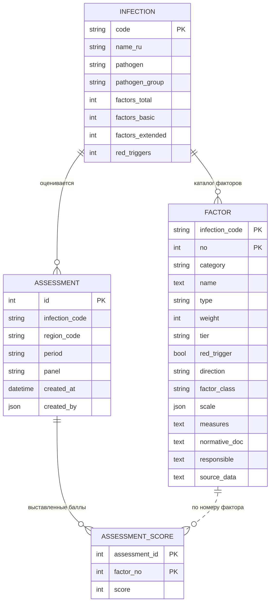

# Доменная модель

Документ переписан после изучения репозитория `gisbb-forecast`. Прежняя редакция описывала
гипотетическую модель, выведенную из постановки. Теперь модель существует в коде, и гадать не о чем:
ниже описано, **что есть**, и отдельно — **чем это отличается от требований ПЗ**.

Разбор кода — [as-is-gap-analysis.md](as-is-gap-analysis.md).
Схема БД — `bb_risk`, ORM — `app/risk/models.py`.

---

## 1. Реальная модель

> Связь `FACTOR` → `ASSESSMENT_SCORE` показана пунктиром: внешнего ключа нет, `assessment_score`
> хранит только номер фактора без ссылки на каталог.

### 1.1 `Infection` — нозология

**Назначение.** Реестр особо опасных инфекций, по которым ведётся факторная оценка риска.

| Атрибут | Тип | Примечание |
|---|---|---|
| `code` | строка 32, PK | Латинский код: `brucellosis`, `plague`, `tb` … |
| `name_ru` | строка 255 | Наименование |
| `pathogen`, `pathogen_group` | строка | Возбудитель и группа патогенности — **сверх ПЗ** |
| `factors_total`, `factors_basic`, `factors_extended`, `red_triggers` | целое | Счётчики, заполняются из `infections.json` |

**Наполнение.** 13 нозологий. **Жизненный цикл:** справочная запись, создаётся сидом, не удаляется.

### 1.2 `Factor` — фактор риска

**Назначение.** Единица оценки: вес, шкала, признак критичности, панель.

**Составной первичный ключ:** (`infection_code`, `no`) — номер уникален в пределах нозологии,
что соответствует BR-035.

| Атрибут | Тип | Соответствие ПЗ |
|---|---|---|
| `category` | строка 255 | Приложение 3, п.2 |
| `name` | текст | Приложение 3, п.3 — **ограничение 250 символов не наложено**, тип `Text` |
| `type` | строка 16 | `numeric` / `binary` — Приложение 3, п.4 |
| `weight` | целое | Приложение 3, п.5 — **CHECK на диапазон 1–4 в БД отсутствует**, проверка только в движке |
| `tier` | строка 16 | `basic` / `extended` — соответствует полю «Панель» Приложения 2 |
| `red_trigger` | логический | Приложение 3, п.6 |
| `scale` | JSON | Приложение 3, п.7 — словарь `{"0": "…", …, "4": "…"}` |
| `responsible` | текст | Приложение 3, п.8 — **свободный текст, для разграничения доступа непригоден** |
| `direction`, `factor_class`, `measures`, `normative_doc`, `source_data` | — | **Сверх ПЗ** |

**Жизненный цикл.** Создаётся сидом из `data/<code>.json`. Изменение через интерфейс не реализовано.
Перезаливка происходит, только если разошлось число факторов.

### 1.3 `Assessment` — оценка риска

**Назначение.** Сохранённая оценка территории по нозологии за период.

| Атрибут | Тип | Примечание |
|---|---|---|
| `id` | целое, PK | автоинкремент |
| `infection_code` | строка 32, индекс | без внешнего ключа |
| `region_code` | строка 16, индекс | **код КАТО региона или района, одним полем** |
| `period` | строка 32, **допускает NULL** | произвольная строка |
| `panel` | строка 16 | `basic` / `extended` / `full` |
| `created_at` | дата и время | UTC |
| `created_by` | JSON | целиком `userInfo` из токена |

**Жизненный цикл.** Создаётся при `POST /v1/risk/assessments`. Изменение, удаление и аннулирование
не реализованы — согласуется с тем, что в постановке их тоже нет.

### 1.4 `AssessmentScore` — балл по фактору

**Составной первичный ключ:** (`assessment_id`, `factor_no`) — обеспечивает инвариант INV-02
(не более одного балла на фактор в оценке). Внешний ключ на `assessment` с каскадным удалением.

| Атрибут | Примечание |
|---|---|
| `score` | целое, **CHECK на диапазон 0–4 в БД отсутствует**, проверка в движке и через Pydantic |

`[ВАЖНО]` Строка создаётся только при непустом балле (`service.py:71-74`). Отсутствие строки означает
«не оценено», балл `0` означает «оценено нулём» — различие реализовано корректно и соответствует BR-025.

---

## 2. Дельта: чего требует ПЗ, а в модели нет

| # | Требование ПЗ | В модели | Что делать |
|---|---|---|---|
| D-1 | Период двумя обязательными датами `DD-MM-YYYY`, `periodTo` ≥ `periodFrom` (Прил. 2, пп. 5–6) | Одно необязательное строковое поле `period` | Заменить на два поля типа «дата». GAP-04 |
| D-2 | Регион обязателен, район необязателен, вариант «Обобщённо по региону» (Прил. 2, пп. 2–3) | Одно поле `region_code` (КАТО) | Уточнить у БА (`Q-020`) и привести к ПЗ. GAP-05 |
| D-3 | Уровень риска последней оценки в журнале (Прил. 1, п.6) | Индекс, полнота, уровень **не сохраняются** | Добавить расчётные поля в `assessment`. GAP-06 |
| D-4 | Каждый орган заполняет только свои факторы (§3.2) | Роли автора нет, привязки «фактор → орган» нет | Заблокировано `Q-001`, `Q-053`. GAP-01, GAP-02 |
| D-5 | История изменения весов (§3.3) | Таблицы нет | Добавить append-only таблицу |
| D-6 | Статус «Заполнено / Не заполнено» (Прил. 1, п.5) | Понятия «объект» нет | Заблокировано `Q-010` |
| D-7 | Панель определяет состав факторов (Прил. 2, п.4) | Механизм есть, у бруцеллёза **все 46 факторов `basic`** | Нужна разметка от методолога. GAP-03 |
| D-8 | Ограничения целостности: балл 0–4, вес 1–4, длина наименования 250 | В БД отсутствуют, проверки только в приложении | Добавить `CHECK` при ближайшей миграции |
| D-9 | Уникальность оценки по объекту и периоду | Ограничения нет, дубликаты сохранятся молча | Заблокировано `Q-015` |

### 2.1 Сущности, которых нет вовсе

| Сущность | Нужна для | Блокировка |
|---|---|---|
| `FactorWeightChange` — история изменения весов | §3.3, BR-050 | Состав записи — `Q-027`, но минимальный вариант реализуем сразу |
| `Region` / `District` — справочник территорий | Прил. 1 п.3, Прил. 2 пп. 2–3 | `Q-020` |
| Привязка «фактор → ответственный орган» (машиночитаемая) | §1.5, §3.2 | `Q-001` |
| Привязка «пользователь → территория» | §3.1 | `Q-011`; в токене территории нет |
| Проекция журнала | §3.1, Прил. 1 | `Q-010` |

---

## 3. Что изменилось в оценке инвариантов

| # | Инвариант | Прежняя оценка | Фактически в коде |
|---|---|---|---|
| INV-01 | Балл 0–4 | подтверждён | Реализован в движке (`scoring.py:111-113`) и в Pydantic; **в БД ограничения нет** |
| INV-02 | Не более одного балла на фактор | подтверждён | **Реализован** составным первичным ключом |
| INV-03 | Факторы оценки принадлежат её нозологии | подтверждён | Реализован косвенно: каталог выбирается по нозологии |
| INV-04 | Факторы принадлежат зоне ответственности роли | блокирован | **Не реализован**, проверки нет |
| INV-05 | `periodTo` ≥ `periodFrom` | подтверждён | **Неприменим**: полей нет |
| INV-06 | Район принадлежит региону | подтверждён | **Неприменим**: разделения нет |
| INV-07 | У фактора 5 значений шкалы | подтверждён | Не проверяется при загрузке; есть в `validate_catalog`, но она в сиде не вызывается |
| INV-08 | Вес 1–4 | блокирован для правки | Проверяется в движке; **в БД ограничения нет** |
| INV-09 | Номер фактора уникален в нозологии | подтверждён | **Реализован** составным первичным ключом |
| INV-10 | RT-фактор с баллом ≥ 3 → «Красный триггер» | подтверждён | **Реализован** (`scoring.py:130, 57-59`) |
| INV-11 | `N_оценённых` = число сохранённых баллов | подтверждён | **Реализован** (`scoring.py:100-128`) |
| INV-12 | Уникальность оценки по объекту и периоду | блокирован | Не реализован |
| INV-13 | Сохранённая оценка неизменна | блокирован | Соблюдается де-факто: операций изменения нет |

`[ЗАМЕЧАНИЕ]` Функция `validate_catalog` (`scoring.py:174-207`) проверяет каталог на целостность,
включая контроль бинарных факторов, но в `catalog_loader.seed()` **не вызывается**. Каталог
загружается без проверки — стоит подключить при доработке сида.

---

## 4. Модель расчёта

Движок (`app/risk/scoring.py`, версия 5.0) — чистая функция без обращений к хранилищу.
Каталог передаётся в него как список словарей (`service.py:31-46`), баллы — как отображение
«номер фактора → балл».

Возвращаемая структура шире, чем требует ПЗ:

| Поле | Требование ПЗ |
|---|---|
| `integral_index`, `completeness`, `adjusted_index` | §4 |
| `level`, `level_ru` | §4, Прил. 1 п.6 |
| `red_triggers`, `has_red_trigger` | §4 |
| `panel_size`, `assessed`, `not_assessed`, `weighted_sum` | сверх ПЗ, но полезны для интерфейса |
| `by_category`, `by_factor_class` | **сверх ПЗ** |

`[РАСХОЖДЕНИЕ]` Уровней **шесть**, а в ПЗ пять: добавлен `not_assessed` («не оценено») для случая,
когда не заполнен ни один балл. Это разумно и закрывает `Q-005` и `Q-033`, но должно быть
зафиксировано в постановке.

`[ЗАМЕЧАНИЕ]` Проверка красного триггера выполняется **внутри цикла по факторам панели**
(`scoring.py:130`). Следствие: RT-фактор, не входящий в выбранную панель, триггер не активирует.
Для бруцеллёза это сейчас безразлично — все 46 факторов в `basic`, — но станет значимым
после разметки панелей (GAP-03).

---

## 5. Что модель по-прежнему не содержит

`[ПРОБЕЛ]` Отсутствуют и в постановке, и в коде: `Document`, `DocumentRoute`, `Approval`,
`Signature`, `PdfRendering`, `Notification`, `Attachment`, `BackgroundJob`, `AuditLog`
(кроме будущей истории весов), `Plan`, `Inspection`, `Checklist`, `Conclusion`.

Появляться в схеме они не должны без ответов БА (`Q-013`, `Q-021`–`Q-027`).
