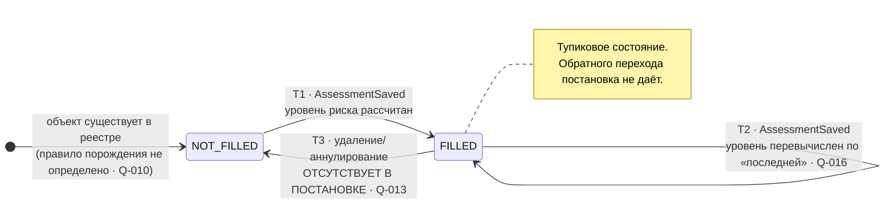
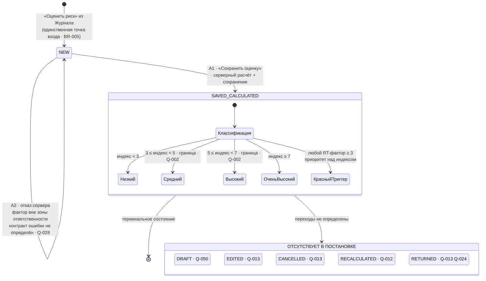
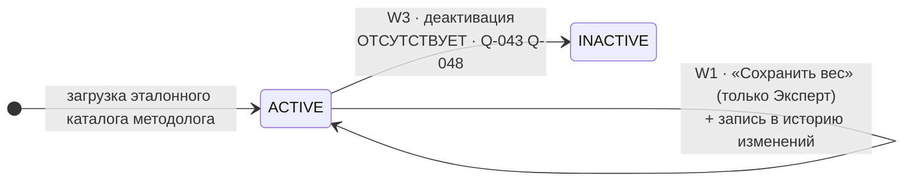

# Конечный автомат процесса

> **Подтверждено кодом.** Вывод о вырожденности автомата оказался верным: в реализации
> у оценки нет ни поля статуса, ни операций изменения, удаления и аннулирования.
> Сохранение — единственный переход, `SAVED_CALCULATED` действительно тупиковое состояние.
>
> Два уточнения:
>
> - уровень «не оценено» из `Q-005`/`Q-033` в коде **уже введён** (`scoring.py:35-42`),
>   то есть таблица решений в разделе 4 дополняется шестым значением;
> - состояние `NOT_FILLED` (FSM-1) в реализации **недостижимо**: журнала нет, а выборка
>   строится по сохранённым оценкам. Это подтверждает опасение из раздела 5.1.
>
> Разбор — [as-is-gap-analysis.md](as-is-gap-analysis.md).

Пометки — см. [overview.md](../01_PRODUCT/overview.md).

---

## 0. Предварительный вывод: автомат вырожден

`[ВЫВОД]` Постановка **не содержит жизненного цикла документа**. Она определяет два перечисления
(статус объекта в журнале и уровень риска), из которых только первое является состоянием, и лишь одно
изменяющее состояние событие — «Сохранить оценку».

Следствие: формально корректный конечный автомат процесса состоит из **двух состояний и одного перехода**.
Это не результат упрощения при анализе — это полное содержание постановки в части состояний.
Всё остальное (черновик, согласование, возврат на доработку, аннулирование) отсутствует и вынесено
в [open-questions.md](../01_PRODUCT/open-questions.md).

Ниже описаны три независимых автомата:

| Автомат | Предмет | Состояний | Переходов |
|---|---|---:|---:|
| **FSM-1** | Объект журнала (нозология + территория + период) | 2 | 2 |
| **FSM-2** | Оценка риска (`RiskAssessment`) | 2 | 1 |
| **FSM-3** | Весовой коэффициент фактора | 1 | 1 (петля) |

Уровень риска (`Низкий` … `Красный триггер`) **состоянием не является**: это детерминированная классификация
результата расчёта, вычисляемая функция от баллов и весов. Она приведена в разделе 4 как таблица решений,
а не как автомат.

---

## 1. FSM-1 · Объект журнала

**Предмет.** Строка реестра, статус которой определяется наличием сохранённых оценок за запрошенный период
(Прил. 1 п.5).

`[БЛОК: Q-010]` Состав «объекта» не определён, поэтому автомат описывает поведение статуса,
но не порождение самих строк.

`[ВЫВОД]` Состояние является **вычисляемым**, а не хранимым: оно зависит от периода в фильтре журнала.
Один и тот же объект одновременно `Заполнено` для одного фильтра и `Не заполнено` для другого.

### Таблица переходов

| # | current_state | event | actor | guards | next_state | side_effects |
|---|---|---|---|---|---|---|
| T1 | `NOT_FILLED` | `AssessmentSaved` | `ROLE_KSEK` / `ROLE_KVKN` / `ROLE_MIO` (для `ROLE_EXPERT` — `Q-007`) | Оценка успешно сохранена; её период пересекается с запрошенным (`Q-017`); объект соответствует нозологии и территории оценки | `FILLED` | В строке появляется уровень риска последней оценки с цветовым индикатором |
| T2 | `FILLED` | `AssessmentSaved` | те же | те же | `FILLED` (петля) | Уровень строки перевычисляется по «последней» оценке (критерий — `Q-016`) |
| T3 | `FILLED` | `AssessmentDeleted` / `AssessmentCancelled` | — | — | `NOT_FILLED` | **Переход отсутствует в постановке** — `Q-013` |
| T4 | `NOT_FILLED` | `PeriodFilterChanged` | любая роль | — | `NOT_FILLED` \| `FILLED` | Не переход состояния объекта, а смена контекста вычисления (`Q-017`) |

### Диаграмма

---

## 2. FSM-2 · Оценка риска

**Предмет.** Экземпляр `RiskAssessment`.

### Таблица переходов

| # | current_state | event | actor | guards | next_state | side_effects |
|---|---|---|---|---|---|---|
| A1 | `NEW` (форма калькулятора, на сервере не существует) | `SaveAssessment` | заполняющая роль | Обязательные поля шапки заполнены (BR-018); `periodTo` ≥ `periodFrom` (BR-022); **все переданные факторы принадлежат зоне ответственности роли** (BR-014); каждый балл ∈ [0..4] (BR-024); `N_оценённых` > 0 — `[БЛОК: Q-005]`; уникальность по объекту и периоду — `[БЛОК: Q-015]` | `SAVED_CALCULATED` | Серверный расчёт: `интегральный_индекс`, `полнота`, `индекс_с_поправкой`, `riskLevel`, `redTriggerFired`; сохранение оценки и баллов; возврат пользователя в журнал; объект журнала → `FILLED` |
| A2 | `NEW` | `SaveAssessment` (нарушен guard) | заполняющая роль | Есть фактор вне зоны ответственности либо провалена валидация | `NEW` | Отказ сервера. Контракт ошибки и атомарность — `[БЛОК: Q-028]`. Данные не сохраняются |
| A3 | `NEW` | `SaveDraft` | — | — | `DRAFT` | **Состояние и переход отсутствуют в постановке** — `Q-050` |
| A4 | `SAVED_CALCULATED` | `EditAssessment` | — | — | `SAVED_CALCULATED` | **Отсутствует** — `Q-013` |
| A5 | `SAVED_CALCULATED` | `DeleteAssessment` / `CancelAssessment` | — | — | `DELETED` / `CANCELLED` | **Отсутствует** — `Q-013` |
| A6 | `SAVED_CALCULATED` | `FactorWeightChanged` | `ROLE_EXPERT` (косвенно) | — | `SAVED_CALCULATED` | **Реакция не определена**: сохранить неизменность, пересчитать при чтении или пересчитать массово — `Q-012` |
| A7 | `SAVED_CALCULATED` | `ReturnForRevision` | — | — | — | **Механизма возврата на доработку в постановке нет** — `Q-013`, `Q-024` |

### Диаграмма

> `[ВЫВОД]` Вложенные состояния классификации показаны внутри `SAVED_CALCULATED` умышленно:
> уровень риска — не отдельный этап жизненного цикла, а атрибут единственного сохранённого состояния.

---

## 3. FSM-3 · Весовой коэффициент фактора

| # | current_state | event | actor | guards | next_state | side_effects |
|---|---|---|---|---|---|---|
| W1 | `ACTIVE` | `SaveWeight` | **только `ROLE_EXPERT`** (BR-016) | Новое значение — число; диапазон 1–4 — `[БЛОК: Q-036]` | `ACTIVE` (петля, новое значение) | Создаётся запись `FactorWeightChange` (BR-050); влияние на сохранённые оценки — `[БЛОК: Q-012]` |
| W2 | `ACTIVE` | `SaveWeight` другой ролью | `ROLE_KSEK` / `ROLE_KVKN` / `ROLE_MIO` | — | `ACTIVE` (без изменения) | Отказ; контракт ошибки — `Q-028` |
| W3 | `ACTIVE` | `DeactivateFactor` | — | — | `INACTIVE` | **Отсутствует в постановке** — `Q-043`, `Q-048` |

---

## 4. Таблица решений: присвоение уровня риска

Не автомат, а чистая функция расчёта (§4 постановки).

| # | Условие | Уровень | Приоритет |
|---|---|---|:--:|
| L0 | Существует балл ≥ 3 у фактора с `isRedTrigger = да` | `Красный триггер` | **высший, переопределяет L1–L4** |
| L1 | индекс `< 3` | `Низкий` | обычный |
| L2 | индекс `3–5` | `Средний` | обычный · граница 5 — `Q-002` |
| L3 | индекс `5–7` | `Высокий` | обычный · границы 5 и 7 — `Q-002` |
| L4 | индекс `≥ 7` | `Очень высокий` | обычный |
| L5 | `N_оценённых = 0` (индекс не вычислим) | **не определено** | `Q-005` |
| L6 | Объект без сохранённых оценок (`Не заполнено`) | **не определено** | `Q-033` |

`[ВЫВОД]` Правило L0 срабатывает независимо от роли автора: RT-факторы распределены между тремя органами
(№ 17, 18 — КВКН; № 21, 24 — МИО; № 31 — КСЭК). Поэтому при раздельных оценках органов (`Q-014`, вариант 1)
«красный триггер» на территории может быть виден в оценке одного органа и отсутствовать в оценке другого
за тот же период. Какой уровень при этом показывать в журнале — следствие `Q-016`.

---

## 5. Проверка автомата

### 5.1 Недостижимые состояния (unreachable)

| Состояние | Достижимо | Комментарий |
|---|---|---|
| `NOT_FILLED` | частично | Достижимо только при наличии правила порождения объектов реестра. Если журнал показывает лишь сохранённые оценки, состояние **недостижимо в принципе**, а требование Прил. 1 п.5 невыполнимо — `Q-010` |
| `FILLED` | да | через T1 |
| `NEW` | да | кнопка «Оценить риск» |
| `SAVED_CALCULATED` | да | через A1 |
| `DRAFT`, `EDITED`, `CANCELLED`, `RETURNED` | нет | Переходов не существует, поскольку событий нет в постановке |
| Уровень `Красный триггер` | да | 5 RT-факторов в каталоге |
| Уровень `Очень высокий` | да | Максимум индекса ≈ 10,70 при полном заполнении (`4 × 123 / 46`), порог 7 достижим |
| Уровень `Низкий` при полном заполнении | да | при преобладании нулевых баллов |

### 5.2 Тупиковые состояния (dead-end)

| Состояние | Тупик | Критичность |
|---|:--:|---|
| `SAVED_CALCULATED` | **да** | **Высокая.** Сохранённая оценка не может быть исправлена, отозвана или удалена. Ошибочно присвоенный «красный триггер» останется в системе навсегда — `Q-013` |
| `FILLED` (FSM-1) | **да** | **Средняя.** Объект не может вернуться в `Не заполнено`; следствие предыдущего пункта |
| `ACTIVE` (FSM-3) | нет | Петля правки веса корректна |

### 5.3 Отсутствующие переходы

| Отсутствующий переход | Последствие | Вопрос |
|---|---|---|
| `NEW → DRAFT` | Невозможно прервать заполнение 13–20 факторов и вернуться позже | `Q-050` |
| `SAVED → SAVED` (правка) | Нет штатного пути исправления ошибки | `Q-013` |
| `SAVED → CANCELLED` | Нет отзыва ошибочной оценки | `Q-013` |
| `SAVED → SAVED` (пересчёт после правки веса) | Не определено, что происходит с историей при изменении весов | `Q-012` |
| `FILLED → NOT_FILLED` | Реестр не может вернуться к незаполненному состоянию | `Q-013` |
| Дозаполнение оценки второй ролью | Невозможно собрать все 46 факторов в одной оценке | `Q-014` |
| Любой переход по событию времени (истечение периода) | Просрочка заполнения системой не фиксируется | `Q-009`, `Q-026` |

### 5.4 Циклы возврата на доработку

**Отсутствуют полностью.** В постановке нет ни одного перехода, возвращающего работу предыдущему актору:
нет согласующего, нет отклонения, нет доработки. Единственные циклы в модели — технические петли:
повторное сохранение оценки по тому же объекту (T2) и повторная правка веса (W1).

`[ВЫВОД]` Ближайший функциональный аналог «доработки» — повторное сохранение новой оценки за тот же период
(вариант 1 в `Q-013`). Но этот путь работает лишь при условии, что «последней» признаётся более поздняя запись
(`Q-016`), и что дубликаты по объекту и периоду допустимы (`Q-015`). Ни одно из этих условий постановкой
не подтверждено, поэтому даже такой обходной путь на данный момент не является определённым поведением.

---

## 6. Итог проверки

| Критерий проверки | Результат |
|---|---|
| Недостижимые состояния | 1 условно недостижимое (`NOT_FILLED`, зависит от `Q-010`) + 4 несуществующих |
| Тупиковые состояния | 2 (`SAVED_CALCULATED`, `FILLED`) — **оба критичны** |
| Отсутствующие переходы | 7 |
| Циклы возврата на доработку | 0 |
| Переходов, полностью готовых к реализации | 1 из 3 автоматов — W1 (правка веса), и то с оговоркой `Q-012` |

**Вывод для разработки.** Реализация конечного автомата в текущем виде создаст систему, в которую
данные можно только добавлять и из которой ничего нельзя исправить. Прежде чем строить слой состояний,
требуется закрыть `Q-013` (исправление данных), `Q-014` (кто владеет оценкой) и `Q-010` (что такое объект реестра).
