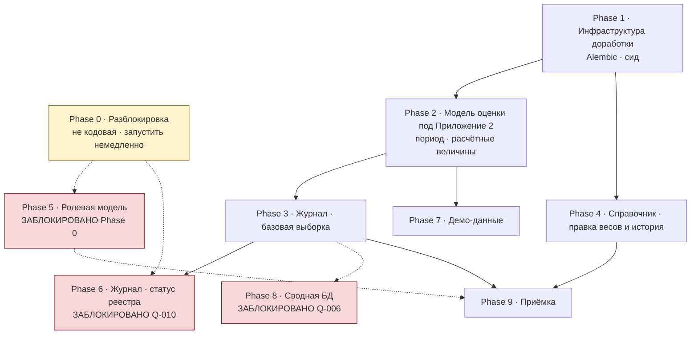

# Дорожная карта разработки

Редакция 2, составлена **от фактического состояния кода** (ветка `origin/test`, коммит `bff4e0b`).
Первая редакция строилась на предположении, что разработка начинается с нуля, и аннулирована.

Основание — [as-is-gap-analysis.md](../02_TECHNICAL/as-is-gap-analysis.md).

**Что уже сделано и в карту не входит:** каркас сервиса, схема `bb_risk`, аутентификация, шлюз,
Eureka, CI и деплой, каталоги 13 нозологий, движок расчёта с тест-векторами, эндпоинты просмотра
каталога и сохранения оценки.

**Границы карты:** только бэкенд `gisbb-forecast`. Фронтенд вынесен в отдельный трек — см. раздел
в конце, его объём не определён.

---

## Обзор

Сплошные стрелки — обязательная зависимость. Пунктир — блокировка внешним решением.

**Ключевое отличие от первой редакции:** фазы 1–4 и 7 можно вести **не дожидаясь ответов
бизнес-аналитика**. Это примерно половина оставшегося объёма.

---

## Phase 0 · Разблокировка

| | |
|---|---|
| **Тип** | Организационный, кода не производит |
| **Когда** | Запустить немедленно, параллельно всему остальному |
| **Почему первым** | Все четыре пункта решаются не разработкой и требуют времени на согласование |

| Что нужно | От кого | Блокирует |
|---|---|---|
| Завести четыре роли ПЗ в Keycloak, согласовав с четырьмя существующими (`BA-36`) | Бизнес-аналитик + администратор платформы + фронтенд | Phase 5 целиком |
| Машиночитаемая привязка «фактор → орган» по 46 факторам (`BA-01`) | Методолог | Phase 5 |
| Разметка 46 факторов бруцеллёза по панелям (`BA-07`) | Методолог | Корректность полноты в расчёте |
| Решение по территории в токене либо справочнику привязки (`BA-04`) | Платформенная команда | Территориальное разграничение в Phase 5 |

**Критерий выхода.** Роли заведены и видны в токене; каталог содержит поле с ответственным органом;
у факторов бруцеллёза проставлены панели.

---

## Phase 1 · Инфраструктура доработки

| | |
|---|---|
| **Цель** | Сделать безопасным изменение схемы и каталога |
| **Зависимости** | нет |
| **Блокировки** | нет |

**Содержание.**

1. Внедрить Alembic. Сейчас `create_all` создаёт недостающие таблицы, но не изменяет существующие —
   любое изменение модели на развёрнутом контуре не применится.
2. Исправить условие перезагрузки каталога. Сид сравнивает **число** факторов, поэтому изменения
   внутри файла при неизменном количестве записей молча игнорируются.
3. Подключить `validate_catalog` к сиду — функция написана, но не вызывается.

**Критерий выхода.** Изменение модели применяется миграцией; изменение содержимого каталога
без изменения числа факторов доезжает до среды; некорректный каталог не загружается.

> **Делать до первого вливания в `test`.** Пуш в эту ветку автоматически раскатывает образ
> на тестовый контур.

---

## Phase 2 · Модель оценки под Приложение 2

| | |
|---|---|
| **Цель** | Привести `assessment` к требованиям формы ввода из ПЗ |
| **Зависимости** | Phase 1 |
| **Блокировки** | Территория — частично `Q-020` |

**Содержание.**

| Что | Основание |
|---|---|
| Период двумя обязательными полями дат с проверкой порядка вместо строки | GAP-04, BR-022 |
| Сохранение расчётных величин: индекс, полнота, скорректированный индекс, уровень, признак триггера, `N_оценённых` | GAP-06, нужно журналу |
| Ограничения целостности в БД: балл 0–4, вес 1–4, длина наименования | BR-024, BR-039, BR-037 |
| Роль и организация автора отдельными полями вместо JSON целиком | Понадобится в Phase 5 |
| Территория: разделение региона и района | GAP-05 — **после ответа на `Q-020`** |

**Критерий выхода.** Сохранённая оценка содержит всё, что требуется журналу, и воспроизводима
без повторного расчёта.

---

## Phase 3 · Журнал — базовая выборка

| | |
|---|---|
| **Цель** | Список сохранённых оценок с фильтрами и пагинацией |
| **Зависимости** | Phase 2 |
| **Блокировки** | Статус «Заполнено / Не заполнено» — `Q-010`, вынесен в Phase 6 |

**Содержание.** Эндпоинт `GET /v1/risk/assessments`: фильтры по нозологии, региону и периоду,
пагинация по конвенции сервиса (`/v1/forecast/runs`), сортировка по умолчанию.
Ограничение выдачи по роли — пока грубое, по существующим `READ_ROLES`.

**Не входит.** Строки со статусом «Не заполнено», ограничение по зоне ответственности,
семантика фильтра по периоду (`Q-017`), область поиска (`Q-018`).

**Критерий выхода.** Сохранённые оценки видны списком, фильтры работают, пагинация соответствует
принятой в сервисе.

---

## Phase 4 · Справочник — правка весов и история

| | |
|---|---|
| **Цель** | Реализовать §3.3 постановки |
| **Зависимости** | Phase 1 |
| **Блокировки** | Поведение прошлых оценок при правке — `Q-012`; состав записи истории — `Q-027`; ограничения веса — `Q-036`; право правки — Phase 5 |

**Содержание.** Таблица истории изменения весов (append-only: фактор, старое и новое значение,
автор, дата и время). Эндпоинт правки веса с проверкой права на сервере. До заведения ролей
проверка выполняется по существующей `WRITE_ROLES`, после Phase 5 — по роли Эксперта.

**Критерий выхода.** Каждая правка порождает ровно одну запись истории; запись неизменяема;
правка без права отклоняется сервером.

---

## Phase 5 · Ролевая модель и разграничение факторов

| | |
|---|---|
| **Цель** | Реализовать §1.5 и §3.2 постановки |
| **Зависимости** | **Phase 0 полностью** |
| **Статус** | **ЗАБЛОКИРОВАНО** |

**Содержание.** Добавление четырёх ролей в `roles.py`; вычисление множества факторов роли
из каталога; фильтрация каталога и журнала по зоне ответственности; серверное отклонение балла
по чужому фактору; территориальное ограничение, если оно потребуется.

**Критерий выхода.** Запрос в обход интерфейса с чужим фактором отклоняется; выдача журнала
не содержит записей вне зоны ответственности.

---

## Phase 6 · Журнал — статус реестра

| | |
|---|---|
| **Цель** | Столбцы «Статус» и «Уровень» по Приложению 1 |
| **Зависимости** | Phase 3, Phase 0 |
| **Статус** | **ЗАБЛОКИРОВАНО** `Q-010`, `Q-014`, `Q-016`, `Q-017` |

**Содержание.** Правило порождения строк реестра; вычисление статуса «Заполнено / Не заполнено»
относительно запрошенного периода; определение актуальной оценки; отображение уровня.

---

## Phase 7 · Демо-данные

| | |
|---|---|
| **Цель** | Реализовать требование §3.2 |
| **Зависимости** | Phase 2 |
| **Блокировки** | Детали — `Q-029` |

Случайное заполнение баллов только по факторам своей роли, отключаемое конфигурацией среды.
Эндпоинт должен быть недоступен в промышленной конфигурации, а не только скрыт в интерфейсе.

---

## Phase 8 · Сводная БД

| | |
|---|---|
| **Статус** | **ЗАБЛОКИРОВАНО** `Q-006` — раздел в постановке не описан |

---

## Phase 9 · Приёмка

Сквозные сценарии, сверка с таблицей статусов в [business-rules.md](../01_PRODUCT/business-rules.md),
регрессия расчёта на существующих тест-векторах, явная фиксация нереализованного.

---

## Отдельный трек · Фронтенд

**Объём не определён — требует решения tech lead.**

Значительная часть постановки описывает интерфейс: реестровый список с панелью фильтров и пагинацией,
кнопка добавления справа сверху, отдельная страница калькулятора без пункта меню, цветовые индикаторы
уровней, кнопки «Применить» и «Сбросить».

Фронтенд находится в другом репозитории: `gisbb-app-ui`, модуль `module-forecast`
(упоминается в `roles.py:5` и в README сервиса).

Правила постановки, относящиеся к фронтенду: BR-004, BR-005, BR-006, BR-008, BR-009, BR-034,
BR-043, BR-045, BR-048.

**Вопрос к tech lead:** входит ли фронтенд в зону работ. От этого зависит примерно половина объёма.

---

## Порядок выполнения

| Очередь | Что | Зависит от ответов |
|---|---|---|
| **1** | Phase 0 — запустить согласования | — |
| **2** | Phase 1 — инфраструктура | нет |
| **3** | Phase 2 — модель оценки | частично (`Q-020` только по территории) |
| **4** | Phase 3 — журнал, базовая выборка | нет |
| **5** | Phase 4 — веса и история | частично |
| **6** | Phase 7 — демо-данные | нет |
| **7** | Phase 5, 6, 8 — по мере разблокировки | да |
| **8** | Phase 9 — приёмка | — |

Фазы 1–4 и 7 не требуют ответов бизнес-аналитика и составляют около половины оставшегося объёма.
Начинать следует с них, одновременно запустив Phase 0.
